nmap scan
```sh
nmap -p- --min-rate 5000 -T4 -Pn 10.82.133.153
Starting Nmap 7.95 ( https://nmap.org ) at 2026-02-08 11:51 IST
Nmap scan report for 10.82.133.153
Host is up (0.17s latency).
Not shown: 65531 closed tcp ports (reset)
PORT      STATE SERVICE
21/tcp    open  ftp
22/tcp    open  ssh
8081/tcp  open  blackice-icecap
31331/tcp open  unknown

Nmap done: 1 IP address (1 host up) scanned in 16.64 seconds
```

```sh
nmap -sC -sV -T4 -Pn -p 21,22,8081,31331 10.82.133.153
Starting Nmap 7.95 ( https://nmap.org ) at 2026-02-08 11:55 IST
Nmap scan report for 10.82.133.153
Host is up (0.15s latency).

PORT      STATE SERVICE VERSION
21/tcp    open  ftp     vsftpd 3.0.5
22/tcp    open  ssh     OpenSSH 8.2p1 Ubuntu 4ubuntu0.13 (Ubuntu Linux; protocol 2.0)
| ssh-hostkey: 
|   3072 e6:ca:ca:e9:ad:fe:81:4e:18:81:2d:52:74:f0:6c:ed (RSA)
|   256 94:40:d2:6b:a6:8e:59:f4:4d:d3:ac:5b:8f:f0:a0:5d (ECDSA)
|_  256 78:f6:a5:34:8d:19:90:96:8c:ae:0c:69:75:21:8e:5c (ED25519)
8081/tcp  open  http    Node.js Express framework
|_http-cors: HEAD GET POST PUT DELETE PATCH
|_http-title: Site doesn't have a title (text/html; charset=utf-8).
31331/tcp open  http    Apache httpd 2.4.41 ((Ubuntu))
|_http-server-header: Apache/2.4.41 (Ubuntu)
|_http-title: UltraTech - The best of technology (AI, FinTech, Big Data)
Service Info: OSs: Unix, Linux; CPE: cpe:/o:linux:linux_kernel

Service detection performed. Please report any incorrect results at https://nmap.org/submit/ .
Nmap done: 1 IP address (1 host up) scanned in 18.54 seconds
```

Nmap scan was able to detect 3 service running on the target machine. We have the FTP (21), SSH (22), HTTP (8081, 31331). Since we don’t have any credentials for the FTP service or SSH service, let’s start enumeration from HTTP Service.

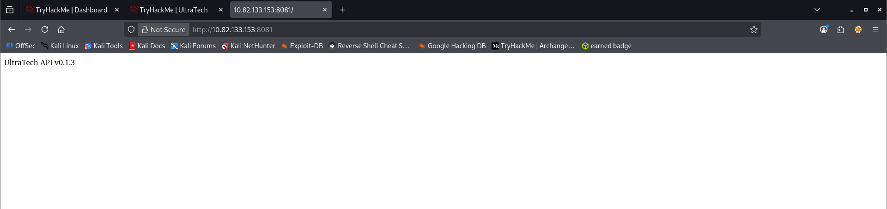

Since this was an API, there must be a web application that is pulling data from this API. We open the second HTTP service running on the port 31331. We find our web application. It a stock web application with a bunch of pages.

While we are enumerating the Web Application manually, let’s run a Directory Bruteforce on the API using dirb. After running for a while, it was able to extract two pages auth and ping.
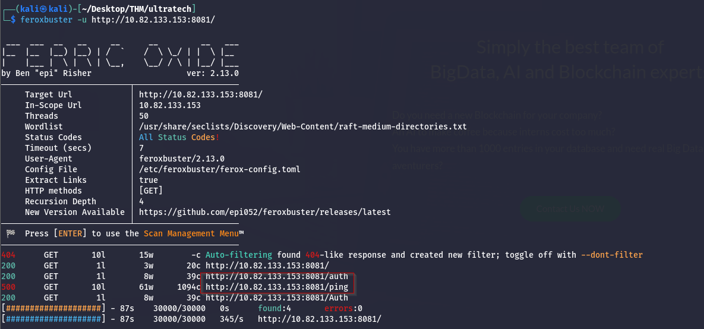
Upon accessing the ping, we see that there is a Handling Error as shown in the image below. Close inspection of the error suggests that there is some parameter or variable missing. Since we don’t have any documentations for the API, we will have to guess about that parameter.
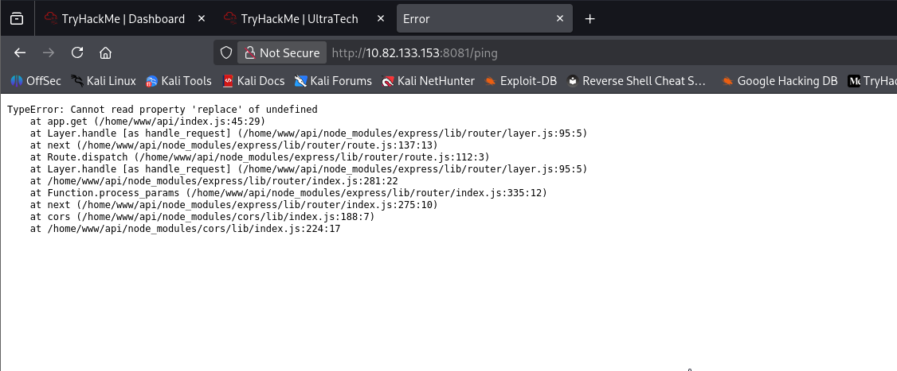

Directory brute forcing on port 31331
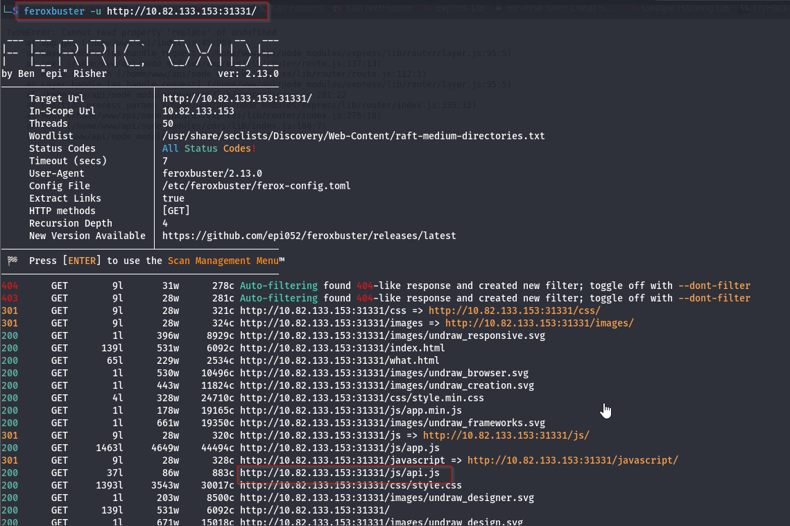
Checking the **api.js** file in the _/js_ directory will give us the URL to enter query parameters.
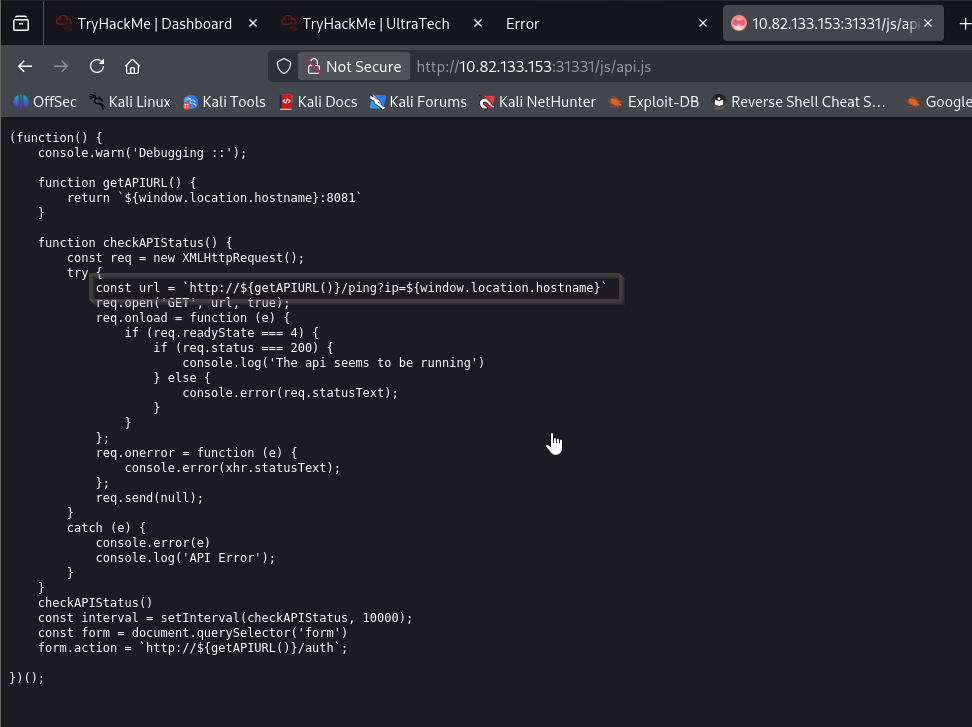

Since it is a ping service, we decided to use the IP parameter with the loopback IP to check if it works. We were able to run the ping command on the target machine from API.
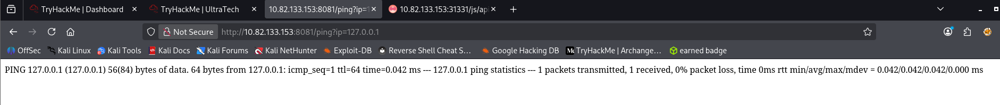

### **Exploitation**

After trying different variants to run another command through the ping command, we were able to run the ls command by inserting the command inside the quotes [“]. We are able to see that there is a SQL file inside the current directory. Since simply entering a command gave an error, we put it in a single quote.
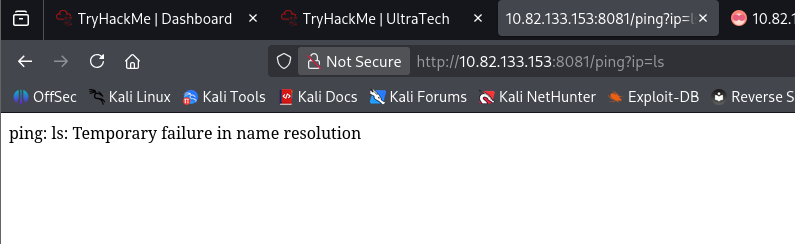
It also gave an error. So we put the command in symbol located below escape button.


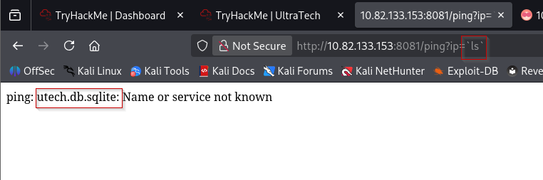

We use the cat command inside the same quotes to read the contents of the SQL database file. Then, we were able to get credentials for a user by the name of r00t. The credentials were however encrypted. To be able to use those credentials, we need to decode them. We can use crackstation as well as hashes.com.
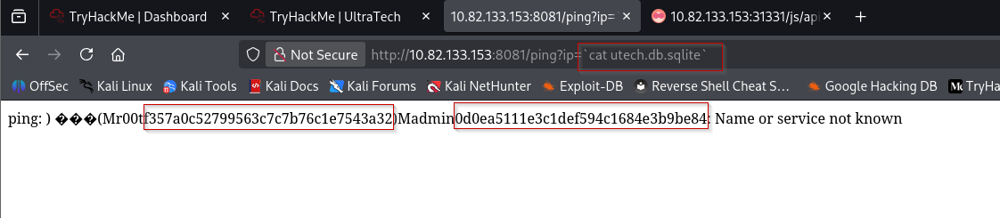
here, we can use simple space between cat and database name or we can add % there as a space. We take the credentials and try to decrypt using online decrypter tool. We were able to read the password for the user r00t admin.
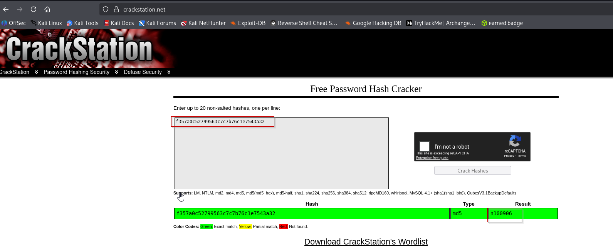
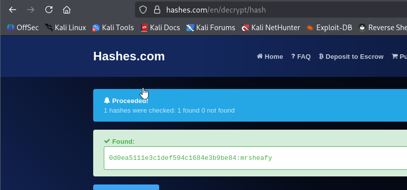

r00t : n100906
admin : mrsheafy

Now that we have the credentials for the r00t user, we use them to connect to the target machine using the SSH service. Then, after getting the shell we ran the id command to find that we are inside a docker instance.
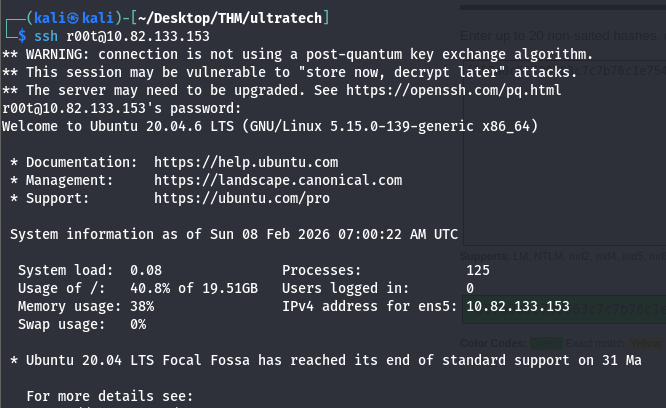
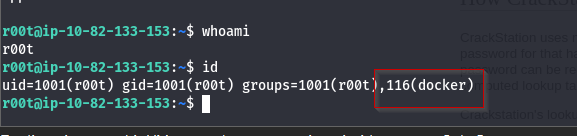
### Privilege Escalation

We will use the **[GTFOBIN](https://gtfobins.github.io/gtfobins/docker/)** to elevate privileges on the target machine. It tells us that in order to get out of the restricted environment of docker, we need to spawn an interactive shell inside the docker.
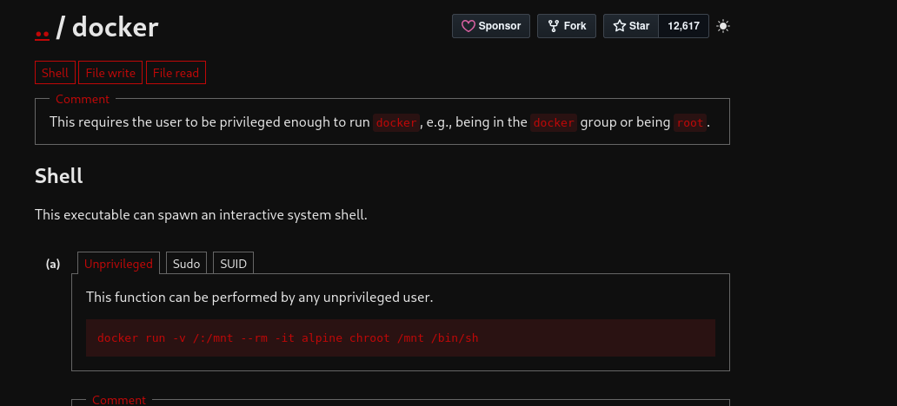
We run the script directly from the GTFOBIN. However, it gave us an error stating that it was unable to find the alpine image. Therefore, we use the docker ps -a command to list the images available on this Docker instance. **We observe that there is an image named bash. As a result, we replace the image name from alpine to bash in the command**. After running the modified command again, we find that we are able to gain root access. Finally, we use the cat command to read the private key for the root user, as required to conclude this machine.
```sh
docker run -v /:/mnt --rm -it alpine chroot /mnt /bin/sh
docker ps -a
docker run -v /:/mnt --rm -it bash chroot /mnt /bin/sh
```


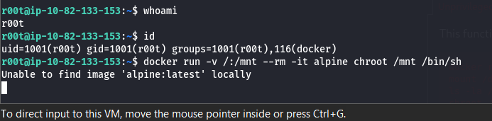


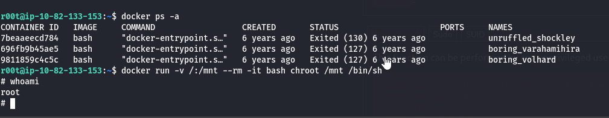
List all directories in the _/root_ directory where we will find the private SSH key in the **.ssh** hidden directory.

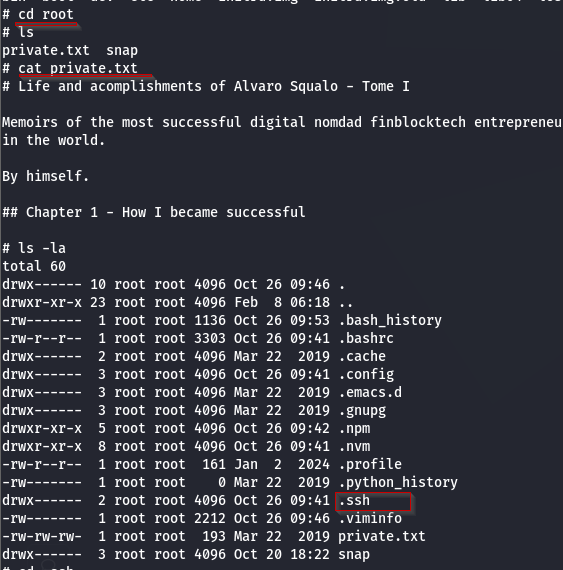

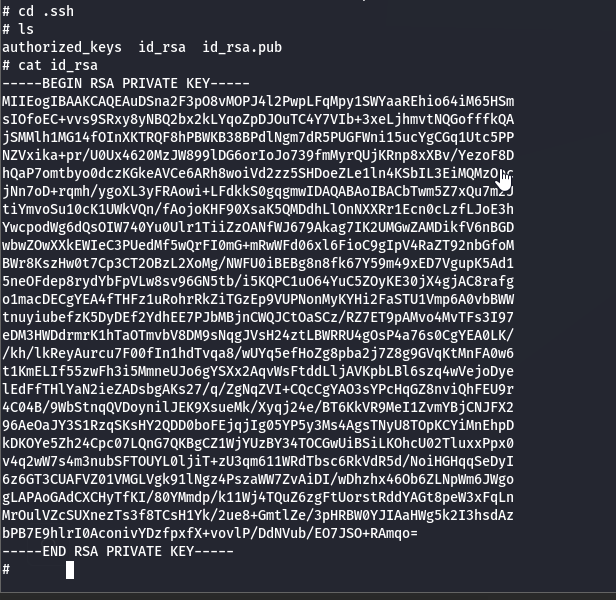
