nmap scan
```sh
nmap -p- --min-rate 5000 -T4 -Pn 10.81.153.1
Starting Nmap 7.95 ( https://nmap.org ) at 2026-02-09 19:13 IST
Warning: 10.81.153.1 giving up on port because retransmission cap hit (6).
Nmap scan report for 10.81.153.1
Host is up (4.2s latency).
Not shown: 59502 closed tcp ports (reset), 6031 filtered tcp ports (no-response)
PORT   STATE SERVICE
22/tcp open  ssh
80/tcp open  http

Nmap done: 1 IP address (1 host up) scanned in 90.85 seconds
```

```sh
nmap -sC -sV -T4 -Pn -p 22,80 10.81.153.1
Starting Nmap 7.95 ( https://nmap.org ) at 2026-02-09 19:16 IST
Nmap scan report for 10.81.153.1
Host is up (0.18s latency).

PORT   STATE SERVICE VERSION
22/tcp open  ssh     OpenSSH 7.6p1 Ubuntu 4ubuntu0.3 (Ubuntu Linux; protocol 2.0)
| ssh-hostkey: 
|   2048 8e:ee:fb:96:ce:ad:70:dd:05:a9:3b:0d:b0:71:b8:63 (RSA)
|   256 7a:92:79:44:16:4f:20:43:50:a9:a8:47:e2:c2:be:84 (ECDSA)
|_  256 00:0b:80:44:e6:3d:4b:69:47:92:2c:55:14:7e:2a:c9 (ED25519)
80/tcp open  http    Golang net/http server (Go-IPFS json-rpc or InfluxDB API)
|_http-title: Follow the white rabbit.
Service Info: OS: Linux; CPE: cpe:/o:linux:linux_kernel

Service detection performed. Please report any incorrect results at https://nmap.org/submit/ .
Nmap done: 1 IP address (1 host up) scanned in 15.45 seconds
```

Visiting port 80
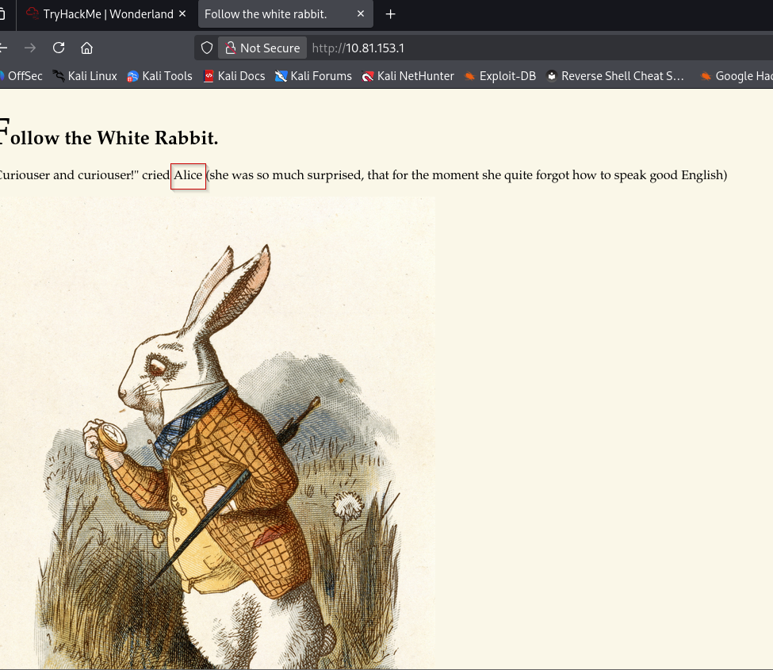
At first glance, this website is very simple: only some text and an image. There are neither links nor menus.

We can check the page’s source code in case there is any hidden information here. Each browser is slightly different but most of them let us right click and select “View page source”. No luck, there is nothing out of place, here.

But the source code is not the only place someone might hide something…

### Steganography: Extracting Hidden Messages From Images

Steganography is a neighboring practice to cryptography. It consists of hiding information inside another message or object. For example, we might hide a message, an image, a video, or any other file inside another file, video, image, or message.

The image on the Wonderland website’s home page looks very ordinary, but could it hide a message? To get to the bottom of this, let’s download it with `wget`:
```sh
wget http://10.81.153.1/img/white_rabbit_1.jpg
```
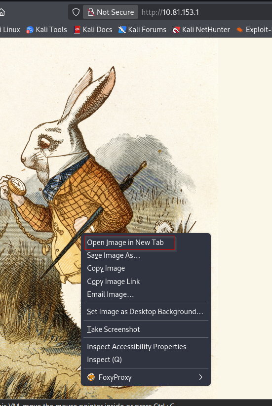

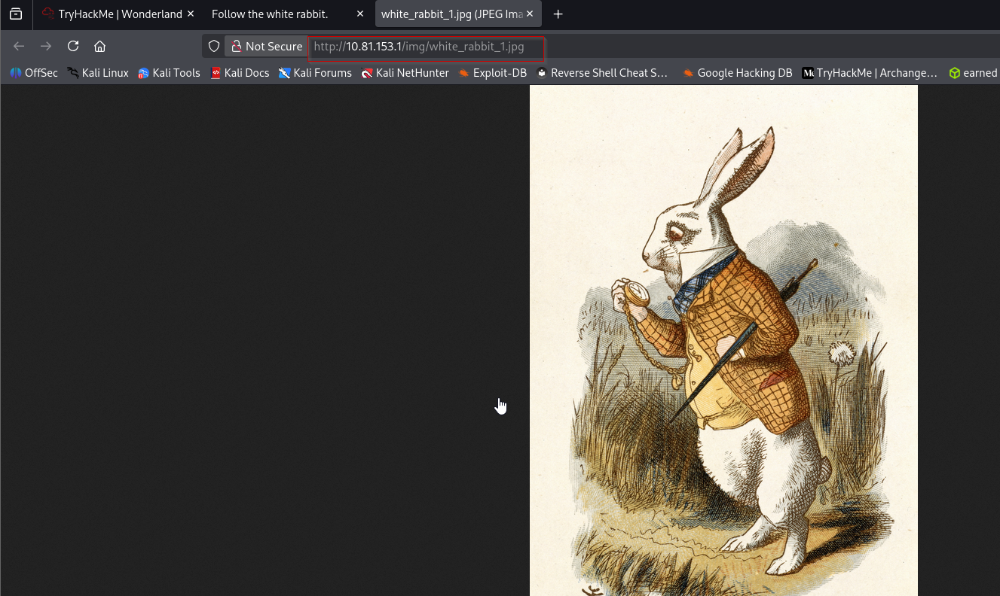
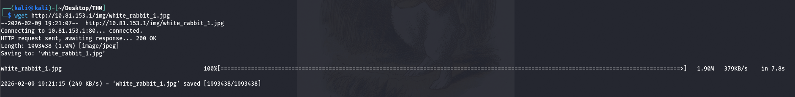
The `steghide` program is one of many tools that allows us to extract a message form a `.jpeg`, `.bmp`, `.wav` or `.au` file, if there is one. Let’s try it:

```sh
steghide extract -sf white_rabbit_1.jpg
```
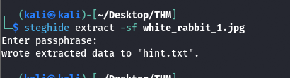
It asks us for a passphrase. Since we don’t have one, let’s just press enter without inputting anything else. `steghide` informs us that it has extracted something in a new `hint.txt` file.
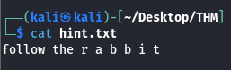
Ah, a hint! Just like on the website, it’s inviting us to “follow the rabbit”. But the spacing in the word “rabbit” is intriguing… We have a clue, but nothing else.

We’ve found something hidden on the page, but what about the rest of the website? There are no links, but that doesn’t mean there are no other pages or directories…
### Finding the Directories of a Website
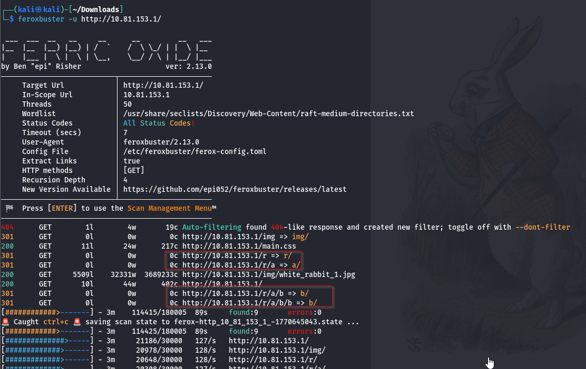
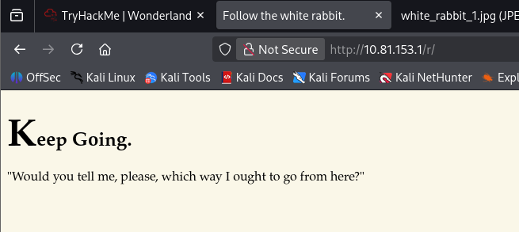
Opening /r/ in the web browser gave me another similar page with the title Keep Going. As the first page said that I need to follow the rabbit and then I have a page /r/, it got me thinking it is possible that the author of the machine must have made a series of pages that look like /r/a/b/b/i/t.
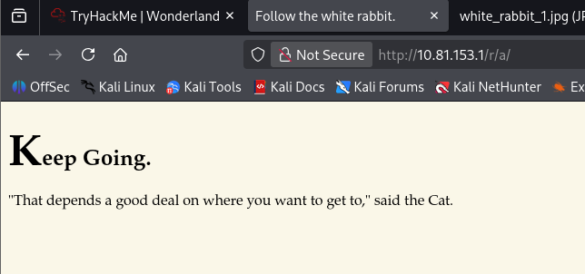

My prediction came fruitful as when I added /a/ after the /r/, I got another page followed by another one at /b/ and so on. Till I got to the last page, which said Open the door and Enter the wonderland. The webpage had an image of a girl which I can only assume is Alice.


The process still don’t make much sense. I decided to get a bit technical and come out to the real world and look at the source code for any clues. It is very easy to miss on the first look but there is a set of credentials that are styled using CSS to be invisible. It is not that difficult to do, all it requires is to give the display a none value.

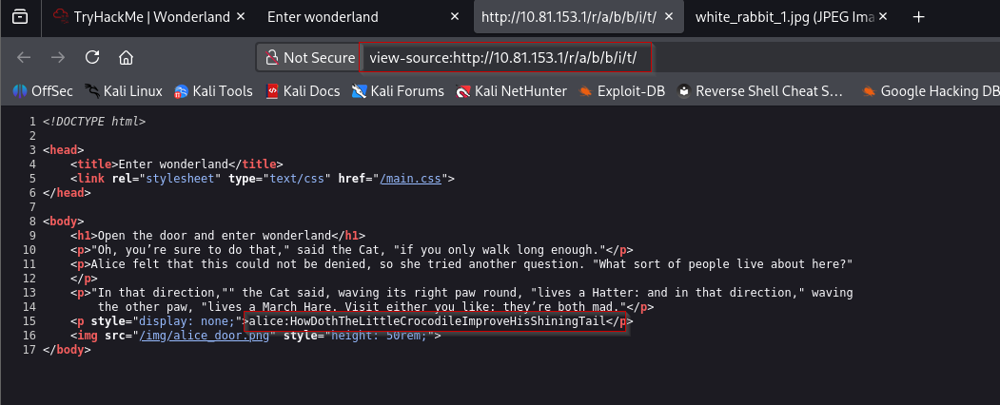
alice:HowDothTheLittleCrocodileImproveHisShiningTail

\### **Exploitation**

The username was alice and the password was HowDothTheLittleCrocodileImproveHisShiningTail. Since I was unable to log in ssh before, we can now try to log in using this set of credentials. After logging in, I tried to enumerate further by listing the contents of the directory. There was a text file named root.txt and a python script walrus_and_the_carpenter.py.
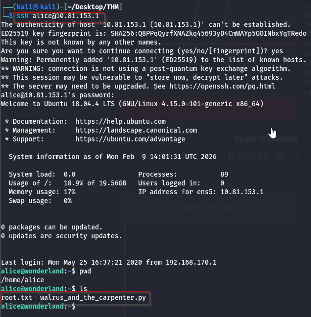
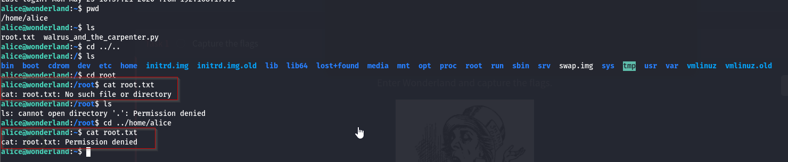
At this stage, it is possible to find the `user.txt` flag we need. For those who don’t want to deduce the way to get this flag from thanks to the hint on TryHackMe’s Wonderland page, the explanation will be written white on white below. There will be many opportunities to get this flag later as well.
The hint for the `user.txt` question on TryHackMe’s Wonderland page says “Everything is upside down here”. If we look at Alice’s home directory, we find a `root.txt` file that she cannot read. Reversing this idea, we might wonder if root has a `user.txt` file that Alice can read. Alice cannot move into the root directory, not can she even see what it contains. But if she has read permissions for that particular file, couldn’t she still do `cat /root/user.txt`?

## Escalating Privileges in Wonderland

Now that we have access to the Wonderland machine, our goal is to escalate privileges until we become root, the system`’s superuser.

Running the `ls -l` command, we can see that Alice has a `root.txt` file, but sadly it doesn’t belong to her. She isn’t allowed to read the flag inside. There is also in interesting Python script here, `walrus_and_the_carpenter.py`.

If we `cd ..` to the `/home` directory, we can also see that there are 3 users on the system, Alice, Rabbit and Hatter. Of course, Alice can’t go explore their directories.

Actually, let’s figure out exactly what Alice is allowed to do with `sudo`. The `sudo` program is a secure way to allow a trusted user to run some commands with elevated root privileges.
```sh
sudo -l
```
The `-l` option here asks `sudo` to list the allowed and forbidden commands for the calling user, in this case, Alice. Something very interesting is happening here:
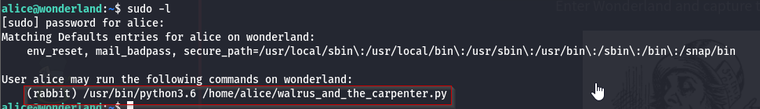

So Alice is allowed to use `sudo` to run the script in her home directory _as the Rabbit user_. This means that if we can manage to insert malicious code into that script somehow, we could potentially get access to Rabbit’s shell. That’s a pretty good privilege escalation vector! So let’s turn our attention to that script.

### Exploiting the Python Script

Unfortunately, Alice doesn’t have the necessary privileges to edit the Python script directly. But with a little research about privilege escalation using a Python script, we quickly come across the idea of library hijacking.
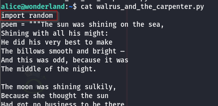

If we examine the `/home/alice/walrus_and_the_carpenter.py` file, we’ll notice the very first instruction: `import random`. It is importing the Python library’s `random.py` module. 
We use the nano editor to create a random.py in the same directory as the walrus_and_the_carpenter.py. Then we proceed to add the shell invocation command into the random.py script that we just created. To give a better understanding, the import function in python gives priority to the modules if they are in the same directory as the modules that might be in the Python directory. We are exploiting this to get our shell command to get executed with the walrus_and_the_carpenter.py.

We use the sudo command to run the script as a rabbit user. Using this we were able to get a shell for the user rabbit. Moving into the home directory of the rabbit user, we found a binary by the name of teaParty.  
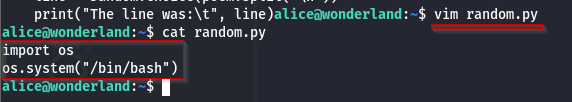
Then, we can execute the `sudo` command, specifying the Rabbit user with the `-u` option:


To inspect the execution, we ran the binary. It said that we need a Mad Hatter which will come approximately one hour from the point we ran the script.
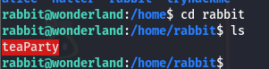
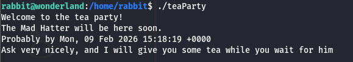
There was an input field, inside which after entering some characters, just spews a Segmentation fault.
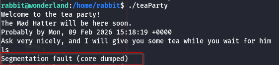
  This was practically not very useful so to take a closer look at it, we transferred it to our local machine.
  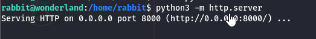
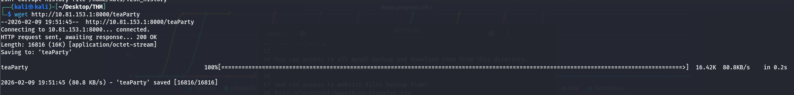

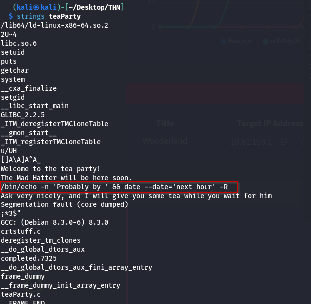
Since the only that the script is doing is running the date command to find out the time and then print the next hour, we need to exploit this. To exploit, we create our version of the date command with shell invocation command and then export the path of our date into the system path so that it executes our date command instead of the original one. We can check if the path was added using the echo $PATH command. After this when we execute the teaParty binary we see that we have the shell as the hatter user.
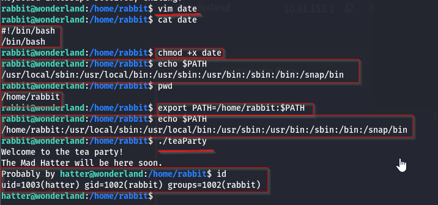
Now that we have the hatter user access, we move into the hatter home directory to find a password.txt. Inside it, we see a password but we don’t see any way to use that password.
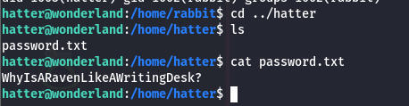
Then at this point where I was truly clueless, I resorted to running the LinEnum to find ways to elevate privileges.  We transfer the LinEnum.sh file from our Local Kali machine to the target machine. After providing proper permission, we run the script.
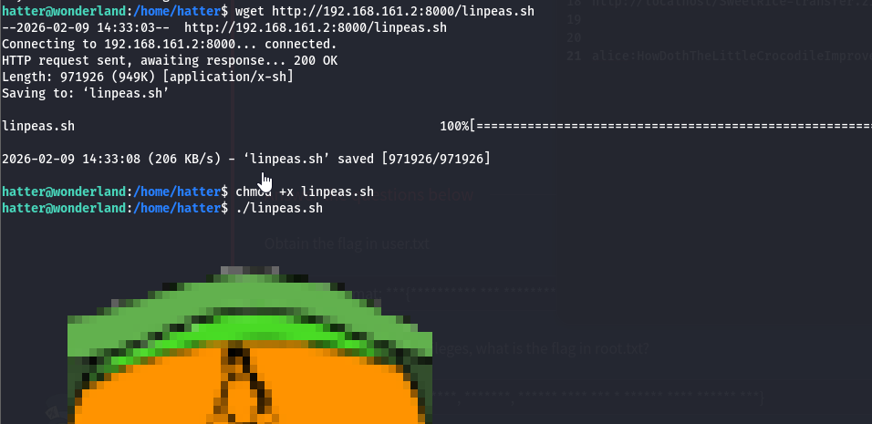

After looking for some time, we found that Perl is set with the capabilities. This could be helpful to get root. **We dont get below as linpeas was not working properly.**

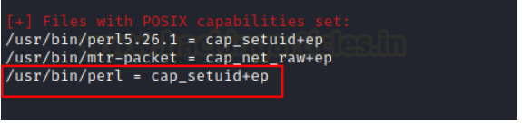
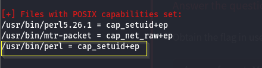

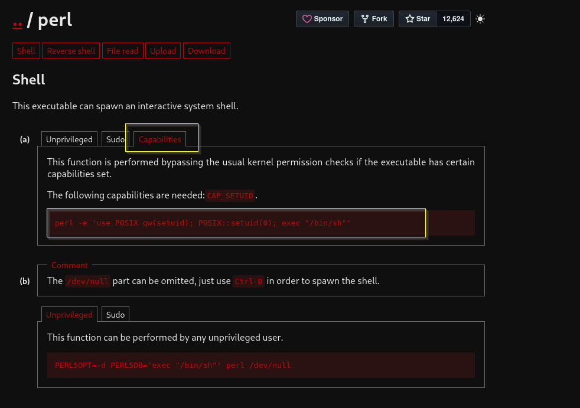


