```sh
sudo nmap -A -T4 -sV -Pn -p- 10.81.138.243
Starting Nmap 7.95 ( https://nmap.org ) at 2026-01-27 19:59 IST
Stats: 0:00:35 elapsed; 0 hosts completed (1 up), 1 undergoing SYN Stealth Scan
SYN Stealth Scan Timing: About 5.03% done; ETC: 20:11 (0:11:20 remaining)
Stats: 0:03:42 elapsed; 0 hosts completed (1 up), 1 undergoing SYN Stealth Scan
SYN Stealth Scan Timing: About 62.30% done; ETC: 20:05 (0:02:15 remaining)
Nmap scan report for 10.81.138.243
Host is up (0.14s latency).
Not shown: 65532 filtered tcp ports (no-response)
PORT     STATE SERVICE       VERSION
80/tcp   open  http          Microsoft IIS httpd 10.0
|_http-server-header: Microsoft-IIS/10.0
|_http-title: Site doesn't have a title.
443/tcp  open  ssl/https
| http-title: Outlook
|_Requested resource was https://10.81.138.243/owa/auth/logon.aspx?url=https%3a%2f%2f10.81.138.243%2fowa%2f&reason=0
| ssl-cert: Subject: commonName=WIN-12OUO7A66M7
| Subject Alternative Name: DNS:WIN-12OUO7A66M7, DNS:WIN-12OUO7A66M7.thm.local
| Not valid before: 2023-01-25T21:34:02
|_Not valid after:  2028-01-25T21:34:02
|_http-server-header: Microsoft-IIS/10.0
3389/tcp open  ms-wbt-server Microsoft Terminal Services
| ssl-cert: Subject: commonName=WIN-12OUO7A66M7.thm.local
| Not valid before: 2026-01-26T14:25:05
|_Not valid after:  2026-07-28T14:25:05
| rdp-ntlm-info: 
|   Target_Name: THM
|   NetBIOS_Domain_Name: THM
|   NetBIOS_Computer_Name: WIN-12OUO7A66M7
|   DNS_Domain_Name: thm.local
|   DNS_Computer_Name: WIN-12OUO7A66M7.thm.local
|   DNS_Tree_Name: thm.local
|   Product_Version: 10.0.17763
|_  System_Time: 2026-01-27T14:35:10+00:00
Warning: OSScan results may be unreliable because we could not find at least 1 open and 1 closed port
Device type: general purpose
Running (JUST GUESSING): Microsoft Windows 2019|10 (92%)
OS CPE: cpe:/o:microsoft:windows_server_2019 cpe:/o:microsoft:windows_10
Aggressive OS guesses: Windows Server 2019 (92%), Microsoft Windows 10 1607 (85%)
No exact OS matches for host (test conditions non-ideal).
Network Distance: 3 hops
Service Info: OS: Windows; CPE: cpe:/o:microsoft:windows

TRACEROUTE (using port 443/tcp)
HOP RTT       ADDRESS
1   159.66 ms 192.168.128.1
2   ...
3   160.30 ms 10.81.138.243

OS and Service detection performed. Please report any incorrect results at https://nmap.org/submit/ .
Nmap done: 1 IP address (1 host up) scanned in 353.43 seconds

```

here are 3 open ports:

80 HTTP port  
443 ssl/https  
3389 ms-wbt-server

port 80 is not working, so let’s check port 443


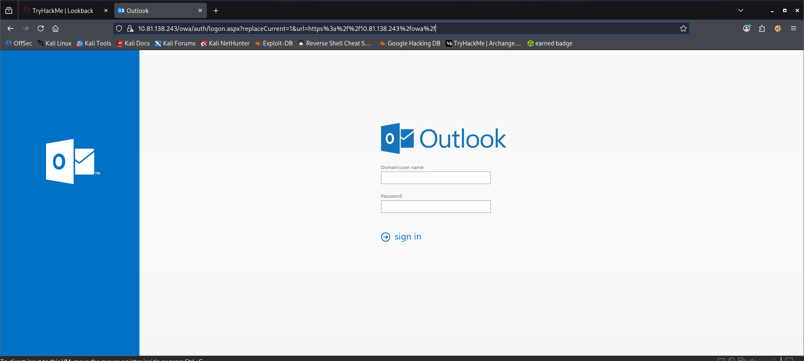

**directory brute forcing**
```sh
feroxbuster -u https://IP --insecure
```

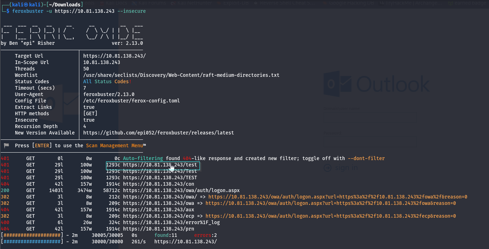
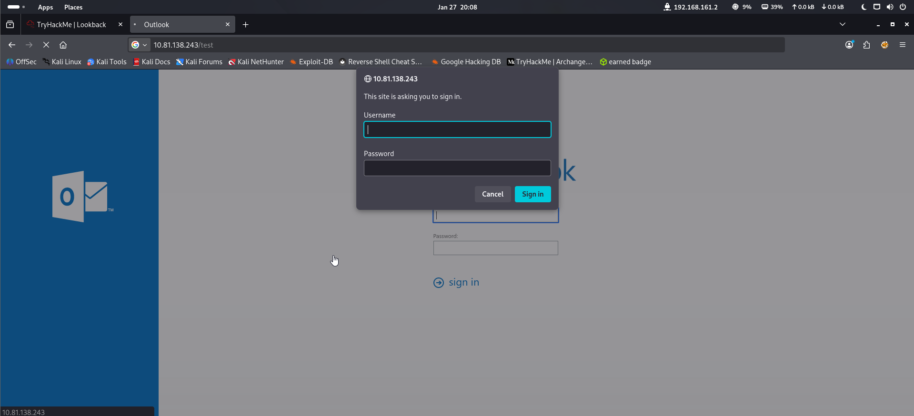

admin:admin

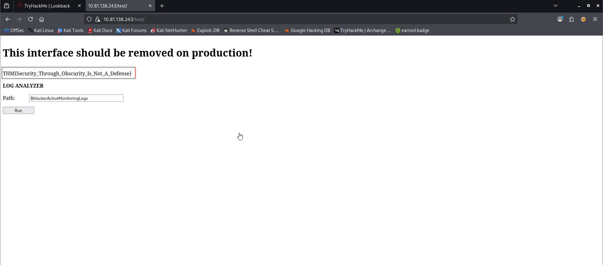
on running ls command we got some error (powershell error)
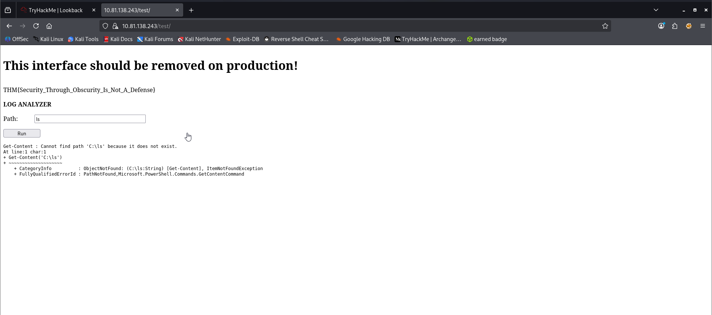

### Method 1
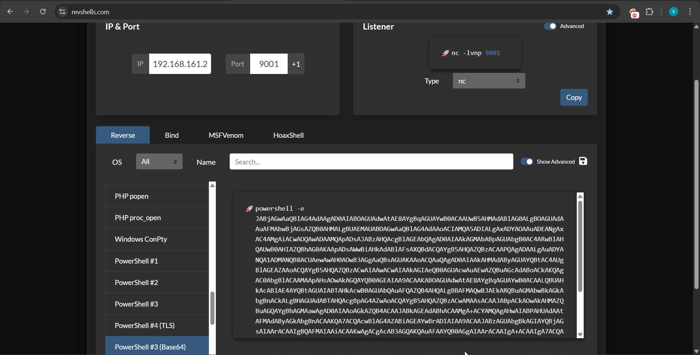
use space between '); and powershell payload
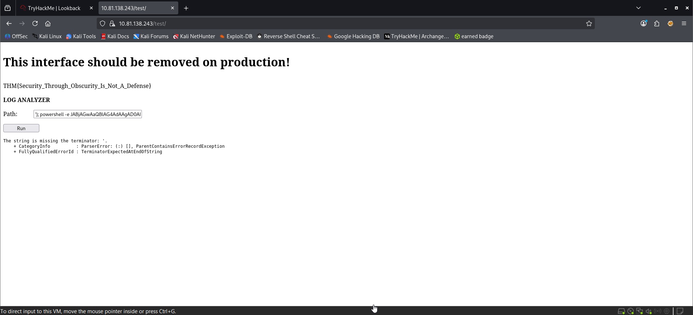
Use space between reverse shell payload and terminator i.e.#
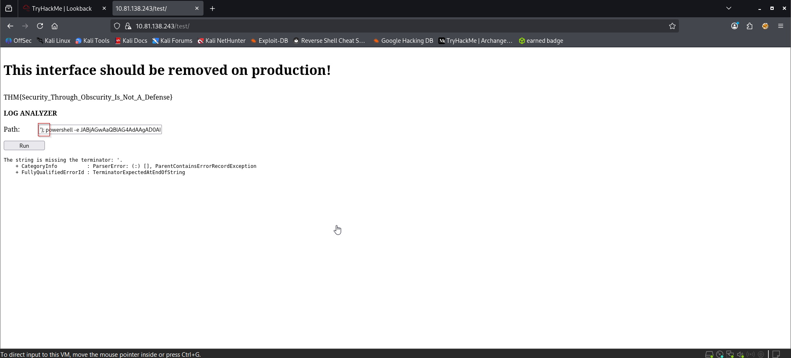

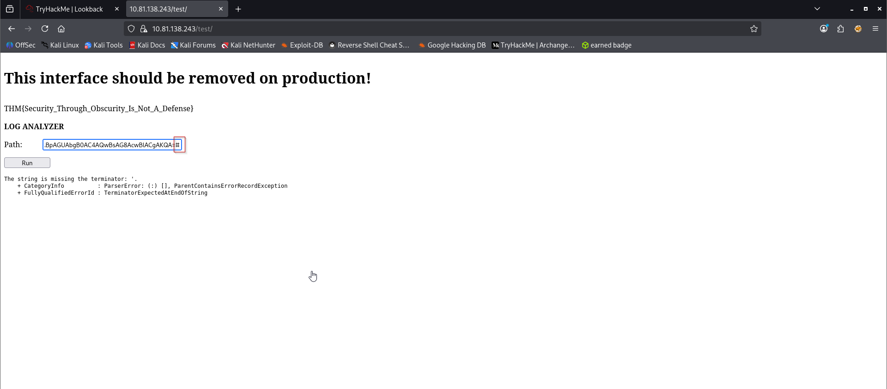
Travel to the below mention path 
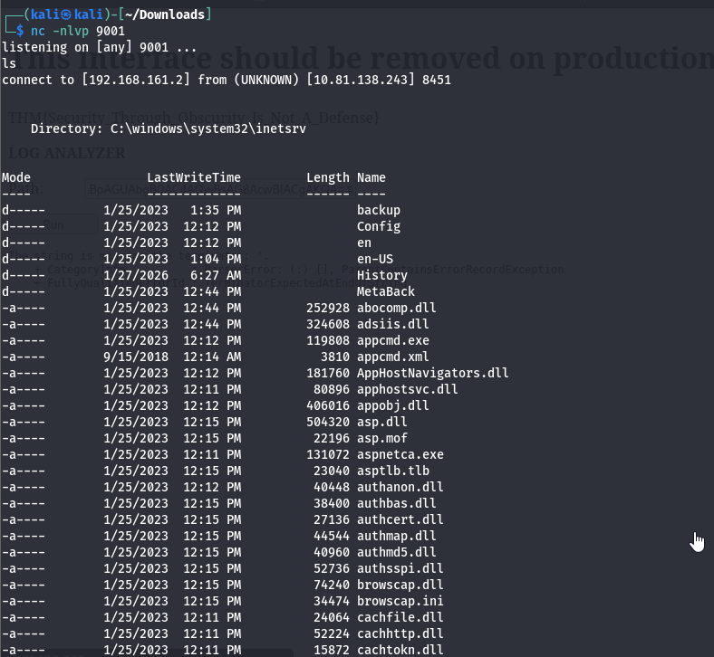

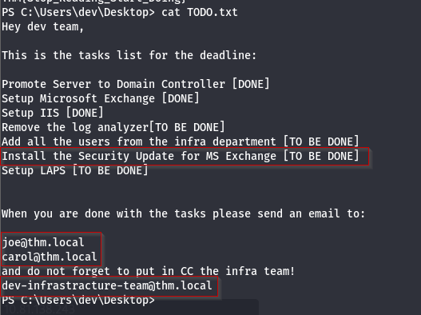
here we saw a to-do list in which it is mentioned that they have to install an MS Exchange security patch .
let’s start our msfconsole and check for MS Exchange payload
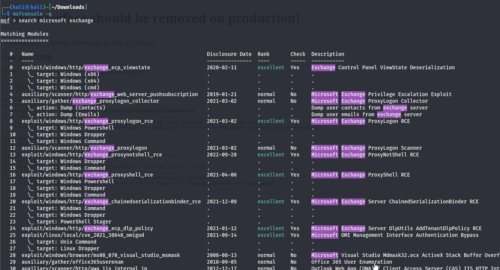

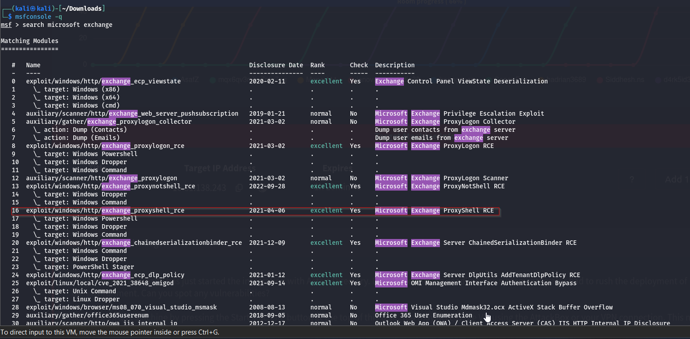

let’s try for different emails
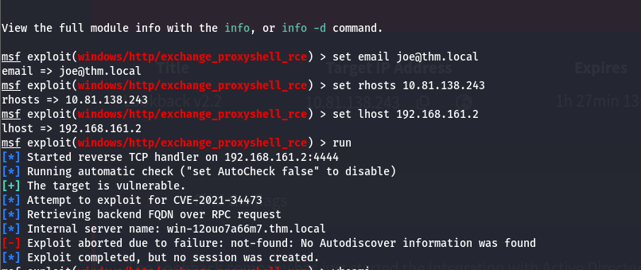

Shell spawned


Travel to below mentioned directory for flag.txt
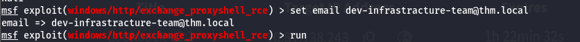
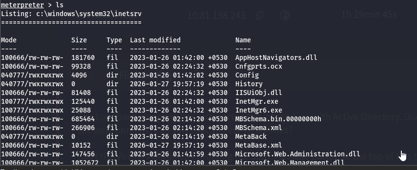

root flag
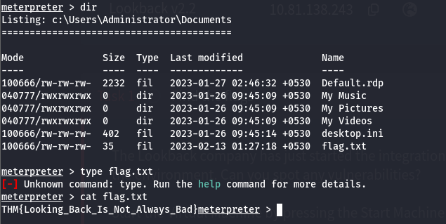